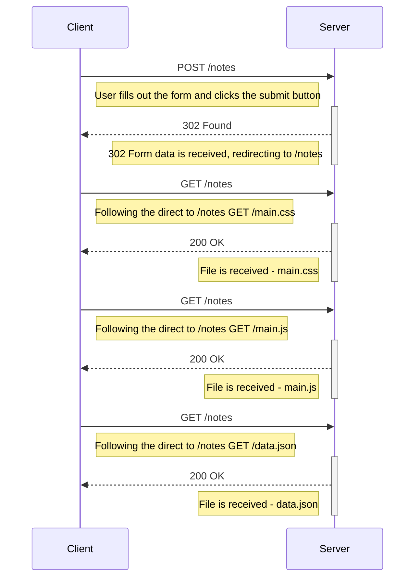

```mermaid
sequenceDiagram
    participant Client
    participant Server

    Client->>Server: POST /notes
    Note right of Client: User fills out the form and clicks the submit button
    activate Server

    Server-->>Client: 302 Found
    Note left of Server: 302 Form data is received, redirecting to /notes
    deactivate Server

    Client->>Server: GET /notes
    Note right of Client: Following the direct to /notes GET /main.css
    activate Server

    Server-->>Client: 200 OK
    Note left of Server: File is received - main.css
    deactivate Server

    Client->>Server: GET /notes
    Note right of Client: Following the direct to /notes GET /main.js
    activate Server

    Server-->>Client: 200 OK
    Note left of Server: File is received - main.js
    deactivate Server

    Client->>Server: GET /notes
    Note right of Client: Following the direct to /notes GET /data.json
    activate Server

    Server-->>Client: 200 OK
    Note left of Server: File is received - data.json
    deactivate Server


```
