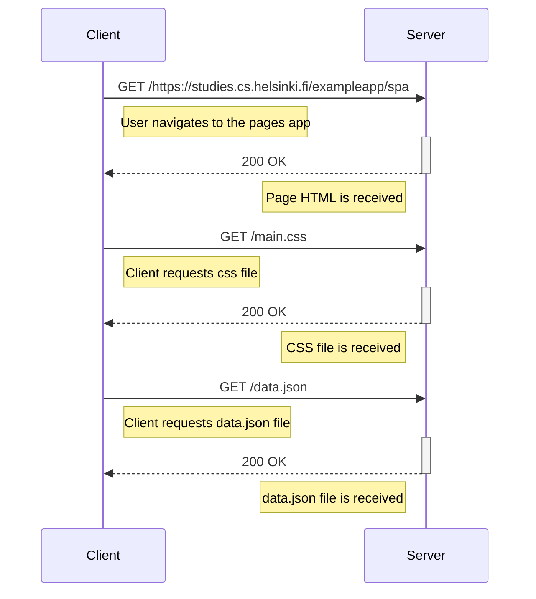

```mermaid
sequenceDiagram
    participant Client
    participant Server

    Client->>Server: GET /https://studies.cs.helsinki.fi/exampleapp/spa
    Note right of Client: User navigates to the pages app
    activate Server

    Server-->>Client: 200 OK
    deactivate Server
    Note left of Server: Page HTML is received

    Client->>Server: GET /main.css
    Note right of Client: Client requests css file
    activate Server

    Server-->>Client: 200 OK
    deactivate Server
    Note left of Server: CSS file is received

    Client->>Server: GET /data.json
    Note right of Client: Client requests data.json file
    activate Server

    Server-->>Client: 200 OK
    deactivate Server
    Note left of Server: data.json file is received


```
