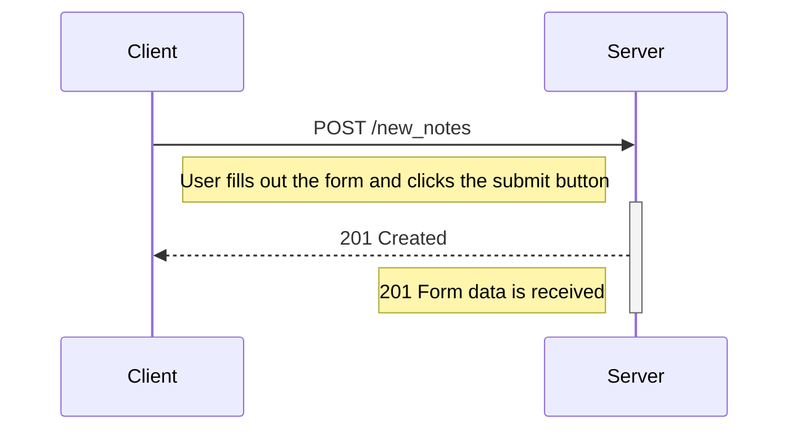

```mermaid
sequenceDiagram
    participant Client
    participant Server

    Client->>Server: POST /new_notes
    Note right of Client: User fills out the form and clicks the submit button
    activate Server

    Server-->>Client: 201 Created
    Note left of Server: 201 Form data is received
    deactivate Server


```
